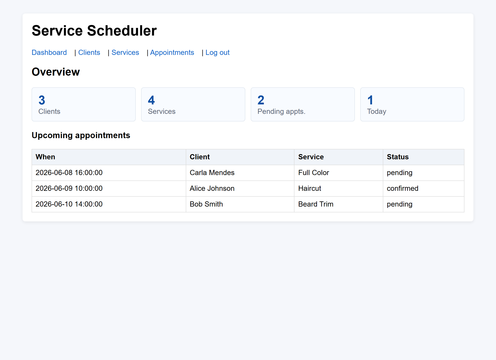
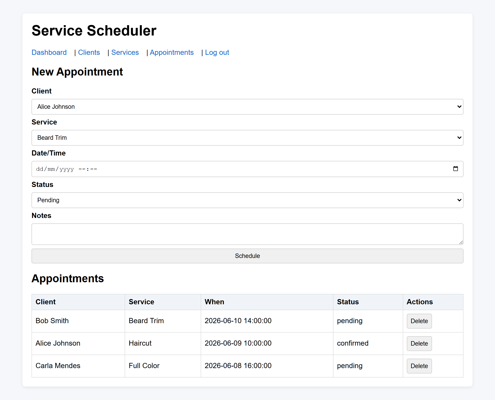

# Basic CRUD PHP — Service Scheduler

A small, dependency-free PHP application that demonstrates a complete CRUD workflow:
user authentication plus management of **clients**, **services**, and **appointments**.
It is intentionally compact — a single front controller, a PDO connection, and one
stylesheet — so it is easy to read end to end and use as a starting point.

## What it does

- **Authentication** — register an account and sign in (passwords hashed with bcrypt via `password_hash`).
- **Dashboard** — at-a-glance counters (clients, services, pending appointments, today's appointments) and a list of upcoming appointments.
- **Clients** — create, list, and delete client records (name, e-mail, phone, notes).
- **Services** — create, list, and delete services (name, description, price, duration).
- **Appointments** — schedule a service for a client at a date/time, with a status (pending / confirmed / done).

All queries use prepared statements (PDO), and output is escaped to mitigate XSS.

## 🎬 Screenshots

| Dashboard | Appointment form |
| --------- | ---------------- |
|  |  |

## Tech stack

- **PHP 8** (uses `declare(strict_types=1)`, typed functions, `password_hash`)
- **PDO** with the **MySQL** driver
- Plain **HTML + CSS** (no framework, no build step, no external dependencies)

## Project structure

```
.
├── config/
│   └── db.php          # PDO bootstrap (reads DB settings from environment variables)
└── public/
    ├── index.php       # Front controller: routing, auth, and all CRUD handlers
    └── styles.css      # Stylesheet
```

`public/` is the web root. `config/db.php` opens the database connection and is
required by the front controller.

## Database

The app expects a MySQL database with the following tables. Create them once before
running:

```sql
CREATE TABLE users (
    id            INT AUTO_INCREMENT PRIMARY KEY,
    name          VARCHAR(255) NOT NULL,
    email         VARCHAR(255) NOT NULL UNIQUE,
    password_hash VARCHAR(255) NOT NULL,
    role          VARCHAR(50)  NOT NULL DEFAULT 'admin',
    created_at    DATETIME     NOT NULL
);

CREATE TABLE clients (
    id         INT AUTO_INCREMENT PRIMARY KEY,
    name       VARCHAR(255) NOT NULL,
    email      VARCHAR(255),
    phone      VARCHAR(50),
    notes      TEXT,
    created_at DATETIME NOT NULL
);

CREATE TABLE services (
    id               INT AUTO_INCREMENT PRIMARY KEY,
    name             VARCHAR(255)   NOT NULL,
    description      TEXT,
    price            DECIMAL(10, 2) NOT NULL DEFAULT 0,
    duration_minutes INT            NOT NULL DEFAULT 30,
    created_at       DATETIME       NOT NULL
);

CREATE TABLE appointments (
    id           INT AUTO_INCREMENT PRIMARY KEY,
    client_id    INT NOT NULL,
    service_id   INT NOT NULL,
    user_id      INT,
    scheduled_to DATETIME    NOT NULL,
    status       VARCHAR(20) NOT NULL DEFAULT 'pending',
    notes        TEXT,
    created_at   DATETIME    NOT NULL,
    FOREIGN KEY (client_id)  REFERENCES clients(id)  ON DELETE CASCADE,
    FOREIGN KEY (service_id) REFERENCES services(id) ON DELETE CASCADE,
    FOREIGN KEY (user_id)    REFERENCES users(id)    ON DELETE SET NULL
);
```

## Run with Docker

The quickest way to try the app. The provided `docker-compose.yml` starts a MySQL 8
database (with the schema and a little English sample data loaded automatically) and
a PHP 8.2 + Apache server, already wired together.

```bash
docker compose up
```

Then open <http://127.0.0.1:8081/> and sign in with the seeded account:

- **E-mail:** `admin@example.com`
- **Password:** `admin123`

> The credentials in `docker-compose.yml` are throwaway values for local development only.

- `schema.sql` and `seed.sql` are mounted into the MySQL container's
  `/docker-entrypoint-initdb.d`, so the tables and sample rows are created on first start.
- The web service maps host port **8081** → container port 80; MySQL maps host port
  **3307** → container port 3306.

To stop and remove everything (including the database volume):

```bash
docker compose down -v
```

## How to run (without Docker)

1. **Configure the database connection.** `config/db.php` reads these environment
   variables (falling back to the defaults shown if unset):

   | Variable  | Default            |
   | --------- | ------------------ |
   | `DB_HOST` | `127.0.0.1`        |
   | `DB_PORT` | `3307`             |
   | `DB_NAME` | `agenda_servicos`  |
   | `DB_USER` | `admin`            |
   | `DB_PASS` | `admin`            |

   Create the database and tables (see [Database](#database) above), then export
   any variables you need to override.

2. **Start the PHP built-in server**, serving the `public/` directory as the web root:

   ```bash
   php -S 127.0.0.1:8081 -t public
   ```

3. **Open the app** at <http://127.0.0.1:8081/>. You will land on the login page —
   follow **Create account** to register your first user, then sign in.

## Author

Created by [RTzinh](https://github.com/RTzinh).
